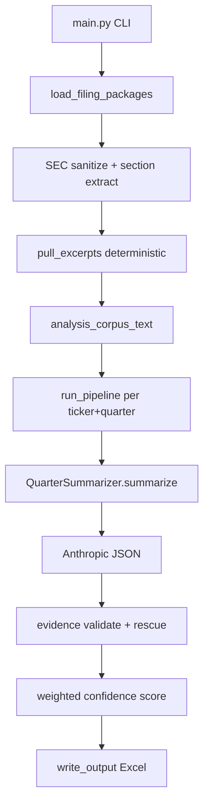

# SEC Filing Confidence Analyzer

Analyze public SEC filings (10-K, 10-Q, 8-K, earnings press releases, investor presentations) to produce next-quarter **confidence scores** with evidence-backed Excel output. Optional point-in-time mode supports backtest hygiene.

Filings can be dropped manually or fetched programmatically from SEC EDGAR (see **EDGAR fetch** below).

## Quick start

```powershell
# One command: fetch missing SEC filings and run analysis
py -3 main.py --filings-root . --companies TSLA,AMZN,NVDA,MSFT --quarter FY2027-Q1 --fetch-missing --single-sheet --output output_confidence/fy2027_q1.xlsx

# Calendar-aligned multi-company run (same period end, per-company fiscal labels)
py -3 main.py --filings-root . --companies Microsoft,Amazon --quarter-end 2025-06-30 --fetch-missing --single-sheet --output output_confidence/qe_2025_06_30.xlsx

# Sector batch (curated ticker list under config/sectors/)
py -3 main.py --filings-root . --sector mega_cap_tech --quarter-end 2025-09-30 --fetch-missing --single-sheet --output output_confidence/qe_2025_09_30_mega_cap_tech.xlsx

# Custom ticker list file (one ticker or company name per line)
py -3 main.py --filings-root . --companies-file config/sectors/mega_cap_tech.txt --quarter FY2026-Q3 --fetch-missing --dry-run

# Company names resolve via SEC company_tickers.json
py -3 main.py --filings-root . --companies "Microsoft,Amazon" --quarter FY2026-Q1 --fetch-missing --output output_confidence/summary.xlsx

py -3 main.py --filings-root data/filings --companies NVDA,AMZN --quarter FY2026-Q1 --output output_confidence/summary.xlsx
py -3 main.py --filings-root data/filings --companies NVDA --quarter FY2026-Q1 --dry-run
py -3 main.py --filings-root data/filings --companies NVDA --quarter FY2026-Q1 --point-in-time --output out.xlsx
py -3 main.py --filings-root data/filings --companies NVDA --quarter FY2026-Q1,FY2026-Q2,FY2026-Q3,FY2026-Q4 --output output_confidence/nvda_fy2026.xlsx
```

Set `ANTHROPIC_API_KEY` in `.env` before running (not needed for `--dry-run`). SEC EDGAR fetch requires a valid `user_agent` in [`config/edgar.yaml`](config/edgar.yaml).

## Folder layout

```text
data/filings/
  NVDA/
    FY2026-Q1/
      manifest.json
      10-Q.txt
      8-K.txt
      press_release.txt
      investor_presentation.txt
    FY2026-Q4/
      manifest.json
      10-K.txt          # Q4 uses 10-K (SEC does not file Q4 10-Q)
      press_release.txt
      # Q1–Q3 10-Qs auto-loaded from sibling FY2026-Q1/Q2/Q3 folders
  AMZN/
    2026-Q1/
      ...
```

**manifest.json** is **auto-generated** when you fetch from EDGAR (`--fetch-missing` or `scripts/fetch_edgar.py`). Manual manifests are optional for hand-dropped filing folders:

```json
{
  "ticker": "NVDA",
  "company_name": "Nvidia",
  "quarter": "FY2026-Q1",
  "fiscal_year": "FY2026",
  "as_of_date": "(05,28,2025)"
}
```

New tickers do **not** require a manifest or an entry in `config/fiscal_calendars.yaml`. On first EDGAR fetch, the pipeline bootstraps a fiscal profile from SEC submissions (`fiscalYearEnd` + `reportDate`) and caches it under `output_confidence/edgar_cache/fiscal_profiles/`. Legacy tickers (AMZN, TSLA, NVDA) still use [`config/fiscal_calendars.yaml`](config/fiscal_calendars.yaml) when present.

Supported document extensions: `.txt`, `.html`, `.pdf`.

### Multiple 8-Ks per quarter

You can include **more than one 8-K** in a quarter folder. Each file is loaded and tagged separately in the corpus.

**Option A — suffix the filename in the quarter folder:**

```text
FY2026-Q1/
  8-K.txt                 # primary (tagged === 8-K ===)
  8-K_2025-05-28.txt      # tagged === 8-K (2025-05-28) ===
  8-K_earnings.txt        # tagged === 8-K (earnings) ===
```

**Option B — use an `8-K/` subfolder for additional filings:**

```text
FY2026-Q1/
  8-K.txt
  8-K/
    item_5_02.txt         # tagged === 8-K (item 5 02) ===
    acquisition.txt
```

Use `_` or `-` after `8-K` in the filename stem. Files inside `8-K/` can use any descriptive name. Run `--dry-run` to see how each file maps to corpus section tags.

### Q1–Q3 vs Q4

| Quarter | Required periodic filing | Notes |
|---------|-------------------------|-------|
| Q1–Q3 | `10-Q.txt` (or at least one of 10-Q, 8-K, press_release) | Standard single-quarter package |
| Q4 | `10-K.txt` | Loader pulls prior `10-Q.txt` from sibling Q1–Q3 folders for cross-reference. With `--fetch-missing`, Q4 fetches (including `--quarter-end` when resolved to Q4) automatically prefetch those sibling 10-Q packages from EDGAR. |

## EDGAR fetch

Programmatically download SEC filings into the folder layout above. Use `--fetch-missing` on `main.py` for a single-command workflow, or run `scripts/fetch_edgar.py` standalone.

Configure SEC fair access in [`config/edgar.yaml`](config/edgar.yaml) (`user_agent` must identify your organization/contact).

```powershell
# Integrated with main pipeline (recommended)
py -3 main.py --filings-root . --companies MSFT,GOOG --quarter FY2026-Q1 --fetch-missing --dry-run

# Standalone fetch CLI (ticker or company name)
py -3 scripts/fetch_edgar.py --ticker Microsoft --quarter FY2019-Q3 --filings-root . --dry-run

# Preview resolved accessions (no download)
py -3 scripts/fetch_edgar.py --ticker AMZN --quarter FY2019-Q3 --filings-root . --dry-run

# Fetch one quarter and validate loader dry-run
py -3 scripts/fetch_edgar.py --ticker AMZN --quarter FY2019-Q3 --filings-root . --validate

# Backfill a quarter range (skips complete folders by default)
py -3 scripts/fetch_edgar.py --ticker AMZN --from FY2017-Q1 --to FY2026-Q4 --filings-root .

# Force re-download
py -3 scripts/fetch_edgar.py --ticker AMZN --quarter FY2019-Q3 --filings-root . --overwrite
```

v1 fetches **10-Q / 10-K + earnings 8-K** only. Press releases and investor decks remain optional manual files. Cached SEC responses live under `output_confidence/edgar_cache/` (gitignored), including per-ticker fiscal profiles.

**Git hygiene:** Fetched filing trees are not meant for version control. After a successful EDGAR fetch (`--fetch-missing` or `scripts/fetch_edgar.py`), the pipeline auto-updates `.gitignore` for new tickers when `--filings-root` is the repo root (`.`), or ignores all of `data/filings/` when you use that path (recommended). Outputs stay under `output_confidence/` (also gitignored).

## Sector / batch company lists

Run many tickers without a long `--companies` string. Provide **exactly one** of:

| Source | Example |
|--------|---------|
| `--companies` | `MSFT,AMZN,NVDA,TSLA` |
| `--companies-file` | `config/sectors/my_watchlist.txt` |
| `--sector` | `mega_cap_tech` → loads `config/sectors/mega_cap_tech.txt` |

List file format: one ticker or company name per line; `#` starts a comment. Built-in sector lists:

- `mega_cap_tech` — MSFT, AMZN, NVDA, TSLA, GOOGL, META, AAPL
- `semiconductors` — NVDA, AMD, AVGO, INTC, QCOM, MRVL, MU

Add your own lists under [`config/sectors/`](config/sectors/) (e.g. `config/sectors/financials.txt`) and pass `--sector financials` or `--companies-file config/sectors/financials.txt`.

## Pipeline



| Stage | Module | Role |
|-------|--------|------|
| Ingest | `src/ingest/filings/` | Discover folders, Q4 sibling 10-Qs, sanitize filings |
| EDGAR fetch | `src/ingest/edgar/`, `scripts/fetch_edgar.py` | Resolve CIK, select filings, download + write quarter folders |
| Excerpt pull | `excerpt_puller.py`, `sec_sanitize.py`, `sec_sections.py` | Build small analysis corpus from high-signal verbatim spans |
| Summarize | `src/llm/quarter_summarizer.py` | Filing prompt + LLM JSON |
| Validate | `src/validation/` | Verbatim excerpt check against analysis corpus, optional rescue judge |
| Score | `src/scoring/analysis_score.py` | Sum of signed analysis weights, clamped [-100, 100] |
| Export | `src/export/csv_writer.py` | One Excel sheet per company (multiple quarter rows on the same sheet) |

## CLI flags

| Flag | Purpose |
|------|---------|
| `--filings-root` | Root with `{TICKER}/{quarter}/` trees |
| `--companies` | Comma-separated tickers or company names (e.g. `MSFT` or `Microsoft`). Mutually exclusive with `--companies-file` and `--sector`. |
| `--companies-file` | Text file with one ticker or company name per line (`#` comments allowed) |
| `--sector` | Curated list from `config/sectors/{name}.txt` (e.g. `mega_cap_tech`, `semiconductors`) |
| `--quarter` | Fiscal quarter label for all companies (e.g. `FY2026-Q1`). Mutually exclusive with `--quarter-end`. |
| `--quarter-end` | Calendar quarter-end date (`YYYY-MM-DD`). Resolves per-company fiscal labels so every company uses the same period end (e.g. `2025-06-30` → MSFT `FY2025-Q4`, AMZN `FY2026-Q2`). When a company resolves to Q4, `--fetch-missing` also prefetches that fiscal year's Q1–Q3 10-Qs for 10-K cross-reference. |
| `--fetch-missing` | Fetch missing SEC packages from EDGAR before load/analysis |
| `--fetch-overwrite` | Re-download EDGAR packages even when folders are complete |
| `--point-in-time` | Strict documents-only mode: temporal prompt, no rescue judge |
| `--dry-run` | Validate folders/manifests; reports raw vs analysis corpus sizes; no API |
| `--skip-rescue-judge` | Drop paraphrased excerpts without rescue |
| `--excerpt-mode` | `smart` (default): deterministic excerpt pull; `full`/`off`: entire sanitized corpus |
| `--max-analysis-chars` | Analysis corpus budget per company when `--excerpt-mode=smart` (default: 400,000) |
| `--max-corpus-chars` | Final hard cap after excerpt pull (default: 1,200,000) |
| `--write-excerpt-audit` | Write pulled corpus to `output_confidence/excerpt_audit/` |

## Output

Excel workbook with columns: Summary Type, Company Name, Quarter (with as-of date), What Happened, Positives, Negatives, Confidence Score, Analysis.

When `--quarter` lists multiple values (comma-separated), each company gets one sheet with one row per quarter, sorted chronologically.

Audit artifacts (when triggered): `output_confidence/evidence_audit/`, `output_confidence/excerpt_audit/`.
