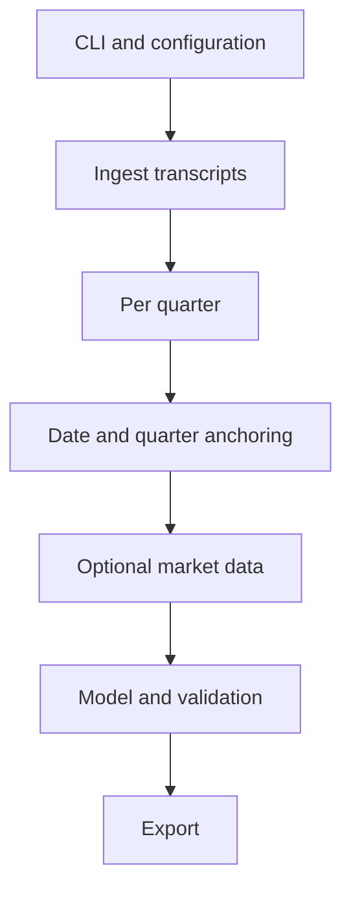
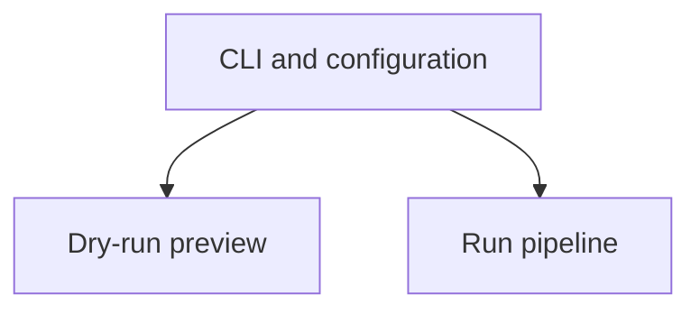

# Earnings Call Summarizer

Summarize earnings call transcripts into structured Excel/CSV output with evidence-backed confidence scores. Optionally includes prior-quarter stock prices and point-in-time modes to reduce data leakage in backtests.

## Pipeline overview

High-level flow from CLI input to export. Each transcript is processed in a per-quarter loop.



With `--dry-run`, the pipeline stops after validation and temporal preview — no API calls.



| Stage | What it does |
|-------|----------------|
| CLI and configuration | Parse args, build point-in-time config, load API key |
| Ingest transcripts | Discover files, assign quarter labels, load text |
| Per quarter | Loop over each transcript in sorted order |
| Date and quarter anchoring | Resolve call date and reported quarter (strict in PIT modes) |
| Optional market data | Fetch 4 prior quarter-end prices when `--ticker` is set |
| Model and validation | Build prompt, call Claude, validate evidence, compute score |
| Export | Write `.xlsx` or `.csv` |

## Pipeline detail

Implementation-specific flow showing files, prompts, audits, and optional second LLM pass.

```mermaid
flowchart TB
    subgraph ENTRY["Entry — main.py"]
        ARGS["Flags: --transcripts --output --model --ticker<br/>--point-in-time --point-in-time-with-prices<br/>--dry-run --skip-rescue-judge ..."]
        PITCFG["PointInTimeConfig"]
        API["AnthropicClient"]
    end

    subgraph INGEST["Ingest — loader.py"]
        DISC["discover_transcript_files()"]
        ASSIGN["assign_quarters() from filename"]
        LOAD["load_transcripts()"]
    end

    subgraph ANCHOR["Strict anchoring — strict_anchoring.py"]
        CD["resolve_call_date_value()"]
        RQ["extract_reported_quarter()"]
        STRICT{"PIT active?"}
        MATCH["Transcript quarter must match filename"]
        FALLBACK["Non-strict: CLI override or filename fallback"]
    end

    subgraph MARKET["Market context — optional"]
        PREV["prior_quarter_labels() → 4 prior quarters"]
        FISCAL["resolve_quarter_end_dates()"]
        YF["fetch_quarter_end_prices() via yfinance"]
        VALIDP["validate_prices_point_in_time()"]
        BLOCK["format_price_block()"]
        PAUDIT["save_price_audit()"]
    end

    subgraph PROMPT["Prompt — quarter_summarizer.py"]
        UC["User: quarter label, PIT cutoff, price block, transcript"]
        SYS["System: prompts/quarter.txt"]
    end

    subgraph LLM1["Primary LLM — anthropic_client.py"]
        CALL1["complete_json() → EvidenceBackedQuarterSummary"]
    end

    subgraph EVID["Evidence — validation/"]
        VAL["validate_quarter_evidence()"]
        RESCUE{"Rescue enabled?"}
        RJ["RescueJudge — LLM #2, rescue_judge.txt"]
        FILTER["filter_quarter_evidence()"]
        EAUDIT["save_evidence_audit()"]
    end

    subgraph SCORE["Scoring and export"]
        RECOMP["apply_confidence_score_from_analysis()"]
        FINAL["QuarterSummary"]
        XLSX["write_output() → .xlsx / .csv"]
    end

    ARGS --> PITCFG --> API
    API --> DISC --> ASSIGN --> LOAD
    LOAD --> CD --> RQ --> STRICT
    STRICT -->|yes| MATCH
    STRICT -->|no| FALLBACK
    MATCH --> PREV
    FALLBACK --> PREV
    PREV --> FISCAL --> YF --> VALIDP --> BLOCK --> PAUDIT
    MATCH --> UC
    FALLBACK --> UC
    PAUDIT --> UC
    UC --> SYS --> CALL1 --> VAL --> RESCUE
    RESCUE -->|yes| RJ --> FILTER
    RESCUE -->|no| FILTER
    FILTER --> EAUDIT --> RECOMP --> FINAL --> XLSX
```



### Mode comparison

| Setting | Ticker / prices | Rescue judge | Temporal header | Quarter validation |
|---------|-----------------|--------------|-----------------|-------------------|
| Default | Optional `--ticker` | On (unless `--skip-rescue-judge`) | No | Filename fallback OK |
| `--point-in-time` | Forced off | Off | Yes | Strict: transcript must match filename |
| `--point-in-time-with-prices` | Required | Off | Yes | Strict + `price_date ≤ call_date` |

### Side artifacts

| Artifact | Path | When |
|----------|------|------|
| Evidence audit | `output_confidence/evidence_audit/` | Every quarter scored |
| Price audit | `output_confidence/price_audit/` | When `--ticker` is used |
| LLM parse errors | `output_confidence/errors/` | JSON parse failure after retry |
| Final output | `--output` path | End of run |

## Quick start

Requires `ANTHROPIC_API_KEY` in `.env` (see `.env.example`).

```powershell
# Default: transcript + optional ticker
py -3 main.py --transcripts data/transcripts/nvidia/FY2025-Q2.txt --output out.xlsx

# Strictest backtest: transcript only, no prices, no rescue
py -3 main.py --transcripts file.txt --point-in-time --output out.xlsx

# Strict with 4 prior quarter-end prices capped at call date
py -3 main.py --transcripts file.txt --ticker NVDA --point-in-time-with-prices --output out.xlsx

# Preview temporal bounds without API call
py -3 main.py --transcripts file.txt --point-in-time --dry-run
```

Run `py -3 main.py --help` for full flag documentation and point-in-time usage notes.
