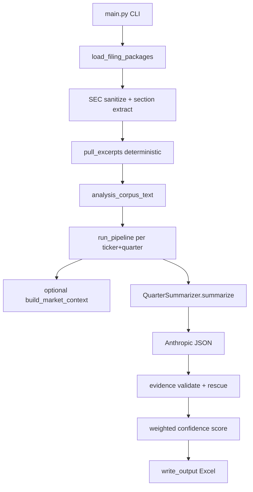

# SEC Filing Confidence Analyzer

Analyze public SEC filings (10-K, 10-Q, 8-K, earnings press releases, investor presentations) to produce next-quarter **confidence scores** with evidence-backed Excel output. Optional prior-quarter stock prices and point-in-time modes support backtest hygiene.

No EDGAR automation in v1 — drop files manually from SEC EDGAR into the folder layout below.

## Quick start

```powershell
py -3 main.py --filings-root data/filings --companies NVDA,AMZN --quarter FY2026-Q1 --output output_confidence/summary.xlsx
py -3 main.py --filings-root data/filings --companies NVDA --quarter FY2026-Q1 --dry-run
py -3 main.py --filings-root data/filings --companies NVDA --quarter FY2026-Q1 --ticker NVDA --output out.xlsx
py -3 main.py --filings-root data/filings --companies NVDA --quarter FY2026-Q1 --point-in-time --output out.xlsx
py -3 main.py --filings-root data/filings --companies NVDA --quarter FY2026-Q1,FY2026-Q2,FY2026-Q3,FY2026-Q4 --ticker NVDA --output output_confidence/nvda_fy2026.xlsx
```

Set `ANTHROPIC_API_KEY` in `.env` before running (not needed for `--dry-run`).

## Folder layout

```text
data/filings/
  NVDA/
    FY2026-Q1/
      manifest.json
      10-Q.txt
      8-K.txt
      press_release.txt
      investor_presentation.txt
    FY2026-Q4/
      manifest.json
      10-K.txt          # Q4 uses 10-K (SEC does not file Q4 10-Q)
      press_release.txt
      # Q1–Q3 10-Qs auto-loaded from sibling FY2026-Q1/Q2/Q3 folders
  AMZN/
    2026-Q1/
      ...
```

**manifest.json** (recommended):

```json
{
  "ticker": "NVDA",
  "company_name": "Nvidia",
  "quarter": "FY2026-Q1",
  "fiscal_year": "FY2026",
  "as_of_date": "(05,28,2025)"
}
```

Supported document extensions: `.txt`, `.html`, `.pdf`.

### Multiple 8-Ks per quarter

You can include **more than one 8-K** in a quarter folder. Each file is loaded and tagged separately in the corpus.

**Option A — suffix the filename in the quarter folder:**

```text
FY2026-Q1/
  8-K.txt                 # primary (tagged === 8-K ===)
  8-K_2025-05-28.txt      # tagged === 8-K (2025-05-28) ===
  8-K_earnings.txt        # tagged === 8-K (earnings) ===
```

**Option B — use an `8-K/` subfolder for additional filings:**

```text
FY2026-Q1/
  8-K.txt
  8-K/
    item_5_02.txt         # tagged === 8-K (item 5 02) ===
    acquisition.txt
```

Use `_` or `-` after `8-K` in the filename stem. Files inside `8-K/` can use any descriptive name. Run `--dry-run` to see how each file maps to corpus section tags.

### Q1–Q3 vs Q4

| Quarter | Required periodic filing | Notes |
|---------|-------------------------|-------|
| Q1–Q3 | `10-Q.txt` (or at least one of 10-Q, 8-K, press_release) | Standard single-quarter package |
| Q4 | `10-K.txt` | Loader pulls prior `10-Q.txt` from sibling Q1–Q3 folders for cross-reference |

## Pipeline



| Stage | Module | Role |
|-------|--------|------|
| Ingest | `src/ingest/filings/` | Discover folders, Q4 sibling 10-Qs, sanitize filings |
| Excerpt pull | `excerpt_puller.py`, `sec_sanitize.py`, `sec_sections.py` | Build small analysis corpus from high-signal verbatim spans |
| Summarize | `src/llm/quarter_summarizer.py` | Filing prompt + LLM JSON |
| Validate | `src/validation/` | Verbatim excerpt check against analysis corpus, optional rescue judge |
| Score | `src/scoring/analysis_score.py` | Sum of signed analysis weights, clamped [-100, 100] |
| Export | `src/export/csv_writer.py` | One Excel sheet per company (multiple quarter rows on the same sheet) |

## CLI flags

| Flag | Purpose |
|------|---------|
| `--filings-root` | Root with `{TICKER}/{quarter}/` trees |
| `--companies` | Comma-separated tickers |
| `--quarter` | Quarter label for all companies. Comma-separated values run multiple quarters into one export (one row per quarter on each company sheet). |
| `--ticker` | Prior-quarter prices (required for `--point-in-time-with-prices`). Filing analysis runs documents-only first; `[price]` bullets are added in a separate pass so document weights stay unchanged. |
| `--point-in-time` | Documents-only strict mode; no prices, no rescue |
| `--point-in-time-with-prices` | PIT + 4 prior quarter-end prices capped at as-of date |
| `--dry-run` | Validate folders/manifests; reports raw vs analysis corpus sizes; no API |
| `--skip-rescue-judge` | Drop paraphrased excerpts without rescue |
| `--excerpt-mode` | `smart` (default): deterministic excerpt pull; `full`/`off`: entire sanitized corpus |
| `--max-analysis-chars` | Analysis corpus budget per company when `--excerpt-mode=smart` (default: 400,000) |
| `--max-corpus-chars` | Final hard cap after excerpt pull (default: 1,200,000) |
| `--write-excerpt-audit` | Write pulled corpus to `output_confidence/excerpt_audit/` |

## Output

Excel workbook with columns: Summary Type, Company Name, Quarter (with as-of date), What Happened, Positives, Negatives, Document-Only Score, Confidence Score, Analysis.

When `--quarter` lists multiple values (comma-separated), each company gets one sheet with one row per quarter, sorted chronologically.

Audit artifacts (when triggered): `output_confidence/evidence_audit/`, `output_confidence/price_audit/`, `output_confidence/excerpt_audit/`.
